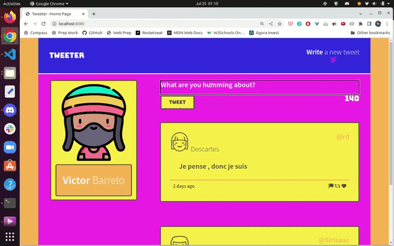

# Tweeter Project

Tweeter is a single-page Twitter clone, where users can create short posts of up to 140 characters and have them append to the main page. Posts are sequential, with the most recent posts appearing at the top of the page. To do so, Tweeter fetches a list of posts from a simplified ‘server’ and allows users to add posts to this list dynamically. All the requests will be made asynchronously, which will allow us to gain familiarity using the jQuery library to make these requests.

This project was build with HTML, CSS, JS, jQuery and AJAX as part of my Lighthouse Labs studies, practicing my front-end skills, and also Node, Express back-end skills.

## Final Product

### Running App

### Designed for Mobile, Tablet and Desktop

## Getting Started

1. [Create](https://docs.github.com/en/repositories/creating-and-managing-repositories/creating-a-repository-from-a-template) a new repository using this repository as a template.
2. Clone your repository onto your local device.
3. Install dependencies using the `npm install` command.
3. Start the web server using the `npm run local` command. The app will be served at <http://localhost:8080/>.
4. Go to <http://localhost:8080/> in your browser.

## Dependencies

- Express
- Node 5.10.x or above

## Enjoy!

